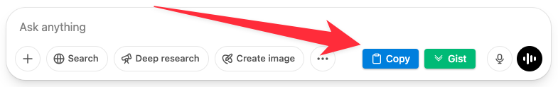
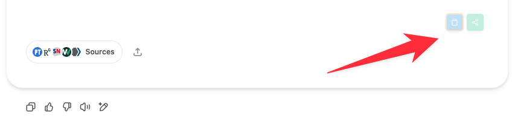

# ChatGPT → GitHub Gist

Tampermonkey userscript to **add share buttons** to
<https://chat.openai.com>, converting the conversation and research reports into Markdown and saving
them as **private GitHub Gists**.


---
## Installation (2 mins)
1. **Install [Tampermonkey](https://www.tampermonkey.net/)** in your browser.
2. Click its toolbar icon → *Create a new script* → paste the contents of **`tampermonkey_script.js`** (this repo) → **Save**.
3. Refresh any open ChatGPT tab; share buttons will appear in the chat interface.

---
## First‑use setup
The first time you press any share button, the script will prompt for a **GitHub Personal‑Access Token (PAT)**:
1. Visit <https://github.com/settings/tokens/new?scopes=gist&description=ChatGPTShare>  
2. Tick the **"gist"** scope (✱the only permission required✱).  
3. Generate, copy, and paste the token into the prompt.  
4. The token is stored locally via Tampermonkey's `GM_setValue`; **never sent anywhere except GitHub**.

You can update/clear the PAT later via Tampermonkey's *Storage* panel or by running `localStorage.removeItem('github_pat')` in DevTools.

---
## Usage

### Main Share Button
The script adds a main "Share" button to the chat interface that exports the entire conversation:



1. Chat as usual on ChatGPT.  
2. Click the **Share** button at the bottom of the chat.  
   * A status banner appears ("Preparing… → Uploading…").  
   * A new tab opens with your **private Gist** containing `chatgpt_conversation.md`.

### Research Report Share Buttons
When ChatGPT generates "deep research" reports, the script adds dedicated share buttons at the top and bottom of each research report:



1. Hover over any research report section to see the share buttons.
2. Click either the top or bottom share button on a research report.
   * A status banner appears ("Preparing research report… → Uploading…").
   * A new tab opens with a **private Gist** containing just that research report.

The Markdown format for full conversations mirrors:
```md
# ChatGPT Conversation

## 🧑 User
…
---

## 🤖 Assistant
…
---
```

For research reports, the format is:
```md
# ChatGPT Research Report

[Content of the research report with formatting and links preserved]
```

Use GitHub's *Download ZIP* or *Raw* to retrieve the file, or share the Gist URL.

---
## FAQ
### Does this leak my chat to any third party?
Only to **GitHub**, and only after **you explicitly press a share button**. The script runs entirely in‑browser, scraping the DOM you can already see.

### Can I make the Gist public?
In `tampermonkey_script.js` change `public: false` to `true` inside `uploadGist()`.

### Where's the code that extracts the messages?
See `scrapeConversation()` in the userscript for full conversations and `scrapeResearchReport()` for individual research reports. The script identifies messages using data attributes in the ChatGPT DOM and handles special formatting like citation links.

### What are the different buttons for?
- **Main Share Button**: Exports the entire conversation to a Gist.
- **Research Report Share Buttons**: Small green buttons that appear at the top and bottom of research reports, allowing you to share just that specific research section without the rest of the conversation.

---
## Uninstall
*Disable* the userscript from Tampermonkey or simply delete it. Stored PATs can
be purged via Tampermonkey's *Storage* tab.
